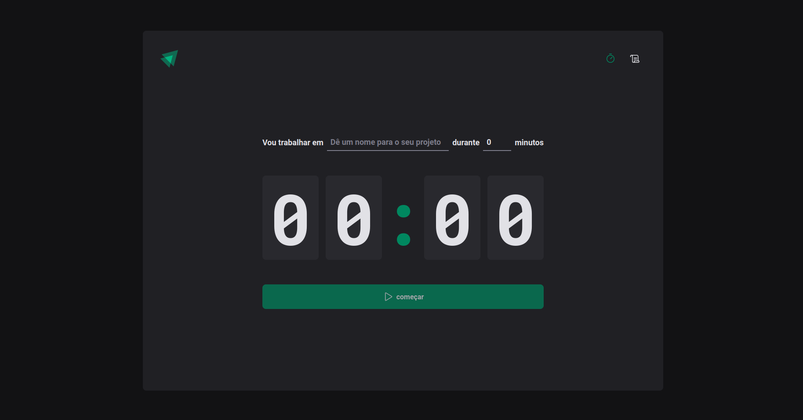

# About the project

Pomodoro is an antiprocrastination application that helps in Getting Things Done. 
It is a simple but effective way to manage your time and to boost your productivity to higher levels. 
Can be used for programming, studying, writing, cooking or simply concentrating on something important.

## Layout mobile
<p align="center">
  
</p>

# Stack and Features

- ReactJS
- Typescript
- Context API
- Styled Components
- Async Storage
- Navigation
- React hooks form

# Running

```
$ yarn install 

Or

$ npm install
```
Start App

```
$ yarn dev
```
